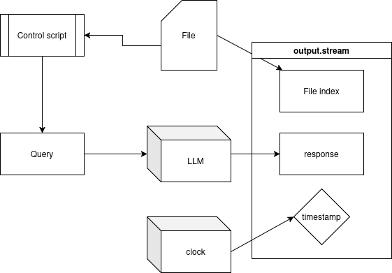

# CS846 project report - Applying LLMs to Alloy models

## Abstract

## Background

### Declarative modelling and Alloy

- what is declarative modelling  and UML
- explanation about alloy
- what is predicate, sig, example code etc.

Software modeling is an important part of software development, used for managing complexity and ensuring correctness [cite].


Alloy is a formal declarative specification language, for expressing structural constraints and behaviour.


The following example is from Jackson's Software Abstractions, with added annotations:

```
module language/grandpa1 ---- Page 84, 85

// a sig declares a set of atoms, with shared properties
abstract sig Person {
	father: lone Man, // lone is a condition on multiplicity, this means that every Person p has exactly one Man m as p.father
	mother: lone Woman
	}

sig Man extends Person {
	// Man inherits all the properties of Person, with additional properties
	wife: lone Woman
	}

sig Woman extends Person {
	husband: lone Man
	}

fact {
	// a fact is a condition on the possible relations between atoms
	no p: Person | p in p.^(mother+father)
	wife = ~husband
	}

assert NoSelfFather {
	// assertions are claims about the relations between atoms, which are not necessarily true. They may be true as a consequence of the definitions of the sigs and facts, which is determined by the Analyzer
	no m: Man | m = m.father
	}

// This should not find any counterexample.
check NoSelfFather

fun grandpas [p: Person] : set Person {
	// fun f [a: T]: U takes an argument of type T and returns something of type U
	p.(mother+father).father
	}

pred ownGrandpa [p: Person] {
	// a function that returns a boolean value
	p in p.grandpas
	}

// This should not find any instance.
run ownGrandpa for 4 Person

assert NoSelfGrandpa {
	no p: Person | p in p.grandpas
	}

// This should not find any counterexample
check NoSelfGrandpa for 4 Person

```

This is a simple model of a familial structure, which asserts that no `Person` p can be their own grandfather or their own father. 

Properties of more complex systems can be modelled similarly, after which the Alloy Analyzer is used to look for counterexamples to assertions about the model's properties.


### LLMs and deepseek

A large language model (LLM) is a machine learning model designed for natural language processing, such as language and code generation. LLMs are trained on a vast corpus of existing examples of text, and can be used to produce new examples of the text. When combined with a prompt, the LLM follows instructions in a manner similar to a chatbot.


Mixture of Experts (MoE) is a machine learning technique where learners operate on the same input, with their outputs combined by a weighting function, to produce a single output.

DeepSeek is a MoE LLM released as an open-weight model. An open-weight model can be run by anyone on their own hardware, as opposed to closed-weight LLMs like Chat-GPT, which can be accesed only via an API. 

The research questions of this project are:

1) Given an Alloy model, how well can deepseek summarize the model in plain english?

2) Can deepseek write valid Alloy models?

2) Given a summary of a model in plain english, how well can deepseek capture the requirements when it constructs the model in Alloy?

The results shed light on LLMs' ability to comprehend and use declarative modelling languages, which could increase the adoption of software modelling in the industry. Since a significant hurdle to the adoption of tools such as Alloy in production is the unfamiliarity of the developers with declarative modelling, the introduction of AI-assisted creation of models may increase the use of Alloy and similar tools (TLA+, Z, B etc.) in software development.

When the earlier example model is fed into deepseek with a request for a summary, the following is produced:

```
This Alloy module defines a family relationship structure and enforces constraints to prevent impossible genealogical cycles (e.g., someone being their own grandfather).
Key Components

    Signatures (sig)

        abstract sig Person: Base type with optional father (Man) and mother (Woman).

        sig Man extends Person: Adds wife (lone Woman).

        sig Woman extends Person: Adds husband (lone Man).

    Constraints (fact)

        No cycles: no p: Person | p in p.^(mother+father) (no person is their own ancestor).

        Spouse symmetry: wife = ~husband (wife/husband are mutual).

    Functions & Predicates

        grandpas[p: Person]: Returns a person’s grandfathers (mother/father → father).

        ownGrandpa[p: Person]: Checks if someone is their own grandpa (impossible by design).

    Verification

        Assertions:

            NoSelfFather: No man is his own father.

            NoSelfGrandpa: No person is their own grandpa.

        Checks:

            check NoSelfFather / check NoSelfGrandpa: Verify assertions hold.

            run ownGrandpa for 4: Confirms no valid instance exists.

Purpo
se

    Model family trees without contradictions.

    Ensure logical consistency (e.g., no time-traveling grandparents).

The Analyzer confirms all constraints are satisfied.

Want to extend this? For example, add siblings or marriages between cousins?

```


## Methodology

### Data collection


The primary data source for Alloy models is GitHub, whose public repositories with `.als` files are scraped by a script. After scraping, the files are passed through a filter which determines the file type, before moving the files to local storage.

Given a corpus of `.als` files containing Alloy code, the version of Alloy is determined via a simple check of the keywords used. Alloy 6 is not back-compatible with earlier versions of Alloy, and is characterized by the following keywords (which do not appear in Alloy 5 code):

```
"after always before enabled event eventually historically invariant modifies once releases since steps triggered until var"
```

Determining the version is carried out by a simple algorithm shown below:

```
def remove_strings(text):
	text = remove_escape_sq(text)
	text = re.sub(r"\"[^\"]*\"","",text,re.DOTALL)
	return text

def check_presence(text):
	text = remove_strings(text)
	text.replace("\n"," ")
	text.replace("\t"," ")
	text.replace("\r"," ")
	for k in keywords:
		if " "+k+" " in text:
			return True
	return False
```

Alloy strings are enclosed in double quotes (`"`). Before checking for the presence of keywords, the string literals are eliminated via a regular expression, since a simple word search will match all occurances of the Alloy-6 keywords, even if they are part of a string literal (which is semantically distinct from occurance in the code). The Alloy version is inserted as a comment at the top of the model code, as:

```
// This is an Alloy 6 model
```

for models whose version is confirmed to be Alloy 6. No modification is done to models which could be interpreted as either Alloy 5 or Alloy 6.

### Invoking the LLM:

Engineering a pipeline to extract data automatically from LLMs has the following requirements:

1) Stability - if a process crashes, the data loss should be minimal.

2) Parallelizability - the pipeline should be easy to expand to run on multiple machines, without relying on interprocess communication between machines.

3) Reproducibility - Since LLMs are stochastic, the results produced are pseudorandom. For independent verification, the results must be reproducible.



The control script reads a file, constructs the prompt from the file, and feeds it into the LLM. The seed is set to be 0, for reproducibility. The output is stored in a `.stream` file, which consists of the following metadata in addition to the response:

1) The generation timestamp (unix epoch)
2) An index which points to the file from which the prompt was generated

After each response generation, a `.stream` file is created and stored in permanent storage. This ensures that if the process crashes:

1) All data stored thus far is saved (except the response being generated during the crash).
2) The process can be recovered by reading the indices of the generating files in the `.stream` file, which allows it to continue with unprocessed files.
3) A real-time alert can be generated for crashes by a separate process that continuously scans the timestamps of the existing `.stream` files and raising an alert if there is a large difference between the current time and the timestamp of the last generated file.

### Prompt engineering

In accordance with the standard best pracitces for prompt engineering, the following was done:

1) The instructions were appended to the beginning of the prompt, to ensure that sufficient attention was allocated to the instruction.

2) The context was clearly separated from the instructions, so the line between the where the instructions to the LLM ends and the model to analyze begins is clear.

The two prepended instructions are:

```
"This is sample Alloy code. Provide an accurate summary of the code, make it as detailed as possible\n"
```

```
"Here is a summary of an Alloy model in plain english. Generate the Alloy code:"+summary+"\n Provide only Alloy code, not a summary"
```

For the second experiment (the generation of the code from the prompt), about 91% of the queries resulted in Alloy code. The presence of code in the response was identified by looking for the presence of "```" in the response, which is used to indicate code segments.

The general structure of a response by deepseek is:

```
<think>
(internal thoughts)
</think>
(explanation)
'''
(code)
'''
(summary of explanation)
```

The constituent parts of the response a separated out via matching using regular expressions.

## Results

### Analysis of the corpus

Initial analysis of the corpus consists of examining simple characteristics like the number of lines, number of tokens and number of characters.


When examining the number of lines, there seems to be a large number of `.als` files with very few lines (which could be because of a large number of empty or very small models in the corpus).


### Analysis of summaries

This section deals with the subset of models which summaries were created for

- length of summary vs length of model
- percentage of thinking vs code vs text

manual analysis of 100 models for correctness:
- number of predicates and signatures explained correctly


### Analysis of reconstructed models

This section deals with the subset of models which summaries were created for, from which models were recreated

## Limitations

- selection bias - manual analysis carrid out for english models only
- model structure does not shed useful light on correctness
- ground truth model is not the ideal form, deviation by AI could mean mistake or a better form of the same model

## Future work:

- running with other AIs and comparative study
- running the model to see if the execution results match

## Acknowledgements

- scraping corpus
- analysis corpus
- deepseek company

## References

- Software Abstractions, D. Jackson
- Static Profiling of Alloy Models - Elias Eid, Nancy A. Day
- relevant papers?